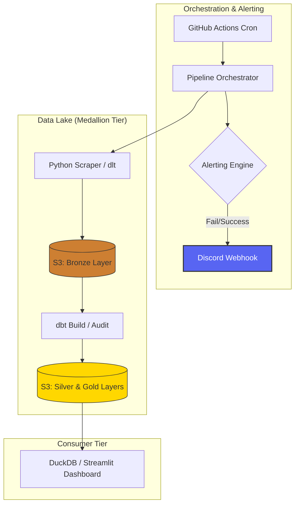

# Agri-Price Intelligence Platform

**Executive Summary**
The Agri-Price Intelligence Platform is an enterprise-grade analytical suite designed to monitor and visualize national agricultural price disparities across the Philippines. By leveraging a high-frequency automated ETL pipeline and a distributed Medallion Data Lake, the platform provides real-time "Visual Intelligence" into regional market dynamics, identifying price gouging via statistical anomaly detection and tracking temporal patterns for strategic procurement.

## Architecture
The platform follows a modern Data Lakehouse pattern with a strictly tiered Medallion Architecture and integrated monitoring.



## Key Technical Features
*   **Medallion Data Lake**: Automated pipeline segregates data into **Bronze** (Raw JSON), **Silver** (Cleaned Parquet), and **Gold** (Analytic Views) to ensure data lineage and integrity.
*   **Statistical Anomaly Detection**: Utilizes dynamic **Z-Score clustering** instead of static benchmarks to identify price outliers and market-level price gouging in real-time.
*   **Temporal Analytics Overhaul**: Features a specialized **Price Volatility Envelope** (Min/Max/Mean spread) and a **Calendar Price Intensity Matrix** (Heatmap) for advanced seasonal and day-of-week pattern recognition.
*   **Enterprise UI/UX**: Radical high-end aesthetics using a strictly enforced **Teal (#0d9488) / Coral (#e11d48) / Slate (#64748b)** palette and a zero-emoji technical communication policy.
*   **FinOps & Performance**: DuckDB-powered backend enables direct S3 Parquet querying with tiered caching for near-instant UI responsiveness.
*   **Proactive Alerting**: Integrated Discord/Slack webhook engine for real-time pipeline status, error reporting, and completion telemetry.

## Tech Stack
*   **Language**: Python 3.12
*   **Compute**: DuckDB (Vectorized SQL Engine)
*   **Storage**: AWS S3 (Hive-partitioned Parquet)
*   **Orchestration**: GitHub Actions (Daily Cron)
*   **Visualization**: Streamlit, Altair, Folium
*   **Engineering**: dlt (Extract/Load), dbt (Transform & Audit)
*   **Monitoring**: Discord/Webhook API

## Local Setup

### 1. Prerequisites
*   Python 3.12+
*   AWS Account with S3 Read/Write permissions

### 2. Configuration
Create a `.env` file in the root directory with your credentials:
```env
# AWS Infrastructure
AWS_ACCESS_KEY_ID=your_access_key
AWS_SECRET_ACCESS_KEY=your_secret_key
AWS_DEFAULT_REGION=ap-southeast-2
S3_BUCKET_NAME=your-data-lake-bucket

# Alerting (Optional)
DISCORD_WEBHOOK_URL=your_discord_webhook_url
```

### 3. Execution
Install dependencies and launch the platform:
```bash
# Install core and dev dependencies
uv pip install -e .

# Run the full pipeline (Extract -> Load -> Transform -> Audit)
$env:PYTHONPATH="."; python scripts/run_pipeline.py

# Launch the Executive Dashboard
streamlit run src/dashboard/app.py
```

---
*Data Source: [DA Bantay Presyo](http://www.bantaypresyo.da.gov.ph/) | Built for Scalable Market Intelligence.*
