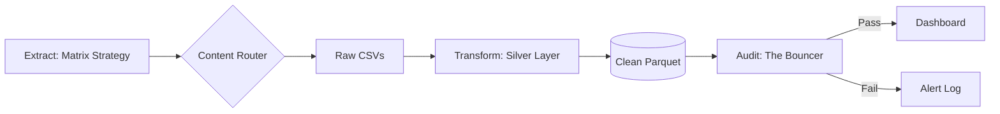

# PRD: Philippine Agri-Price Intelligence Platform (APIP)

**Version**: 3.0 (Stable Release) | **Status**: Maintenance Mode
**Architecture**: Matrix Extraction -> Content-Based Routing -> Silver Layer (Parquet) -> The Bouncer (Audit)

## 1. Executive Summary
**The Vision**: A "Time Machine for Food Prices" that democratizes market intelligence.
**The Achievement**: We have successfully built a resilient, automated data pipeline that survives API instability ("The Matrix") and ensures data integrity ("The Bouncer").

## 2. Agile Roadmap (Phases)

### ✅ Phase 1: Ingestion Engine (The Matrix)
*   **Goal**: Extract granular data despite API fragmentation.
*   **Outcome**: Implemented a nested loop strategy (Regions x Categories) to capture 100% of available data.

### ✅ Phase 2: Data Quality (Silver Layer)
*   **Goal**: Clean, standardize, and optimize storage.
*   **Outcome**: Transformed messy CSVs into strict **Parquet** files with Snappy compression (90% size reduction).

### ✅ Phase 3: Production Scale-Up (The Bouncer)
*   **Goal**: Automated Quality Assurance.
*   **Outcome**: Created `src/validation/simple_audit.py` to auto-reject partial scrapes (<500 rows or <10 regions).

### 🔄 Phase 4: Dashboard (The Bulletin Board)
*   **Goal**: User-facing Intelligence.
*   **Outcome**: Deployed `src/dashboard/app.py` featuring "Category First" design, geospatial maps, and Z-score analytics.

## 3. Technical Architecture (Final)

## 4. Security & Standards
*   **Secrets**: All config maps are code-based (strict). No external API keys needed.
*   **Storage**: Strict separation of Raw (CSV) and Clean (Parquet).
*   **Audit**: Daily `audit_log.txt` tracks system health.
