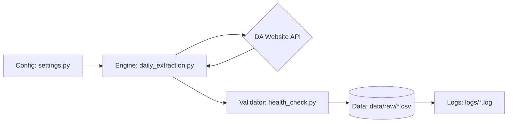

# PRD: Philippine Agri-Price Intelligence Platform (APIP)

**Version**: 2.0 (Production Ready) | **Status**: Active Development
**Architecture**: Python ETL -> GitHub Actions (Planned) -> BigQuery (Planned)

## 1. Executive Summary
**The Vision**: A "Time Machine for Food Prices" that democratizes market intelligence for Filipino consumers and businesses.
**The Problem**: Government price data is ephemeral (deleted daily) and aggregated (hides granular market variances).
**The Solution**: An automated extraction engine that captures, validates, and archives daily price snapshots from the Department of Agriculture.

## 2. Agile Roadmap (Phases)

### ✅ Phase 1: Ingestion Engine (The Foundation)
*   **Goal**: Prove we can parse the DA's messy HTML.
*   **Tech**: Python, `requests`, `BeautifulSoup`.
*   **Outcome**: Successfully scraped single commodity data.

### ✅ Phase 2: Data Quality (The Corn Test)
*   **Goal**: Prove our data is accurate.
*   **Tech**: Hybrid Validation (API vs Manual PDF Benchmark).
*   **Outcome**: Verified data accuracy within 3.8% variance.

### ✅ Phase 3: Production Scale-Up (The Master Loop)
*   **Goal**: Capture the *entire* market state.
*   **Tech**: `src/daily_extraction.py`, `config/settings.py`.
*   **Outcome**: Full NCR extraction (Rice, Meat, Fish, Veggies) ~2,800 rows/day.

### 🔄 Phase 4: Automation (The "Free Cloud")
*   **Goal**: Remove the human. Run automatically every day at 6 AM.
*   **Strategy**: **Git Scraping**.
    *   Use **GitHub Actions** (Free Tier) to run the script.
    *   Commit the CSV results back to the repository.
    *   **Cost**: ₱0 forever.
    *   **Storage**: Git Repository (acts as our Database for MVP).

### 🔮 Phase 5: Analytics (The "Brain")
*   **Goal**: Derive insights.
*   **Ideas**:
    *   "Cheapest Market" Dashboard (Streamlit).
    *   Inflation Alerts (if Price > 15% vs yesterday).

## 3. Technical Architecture (Current)

## 4. Data Dictionary
**File Pattern**: `data/raw/ncr_prices_YYYY-MM-DD.csv`

| Column | Type | Description |
| :--- | :--- | :--- |
| `extract_dt` | DATE | Partition Key. |
| `region_id` | STRING | Filter: NCR (130000000). |
| `market_name` | STRING | e.g., "Commonwealth Market". |
| `category` | STRING | e.g., "Meat", "Rice". |
| `commodity` | STRING | e.g., "Pork Kasim". |
| `price` | FLOAT | Retail Price (Cleaned). |

## 5. Security & Standards
*   **Secrets**: No API keys required yet. Future credentials (GCP) will use GitHub Secrets.
*   **Hygiene**: `logs/` and `.env` are git-ignored.
*   **Rate Limiting**: Scripts sleep 2s between requests to respect government servers.